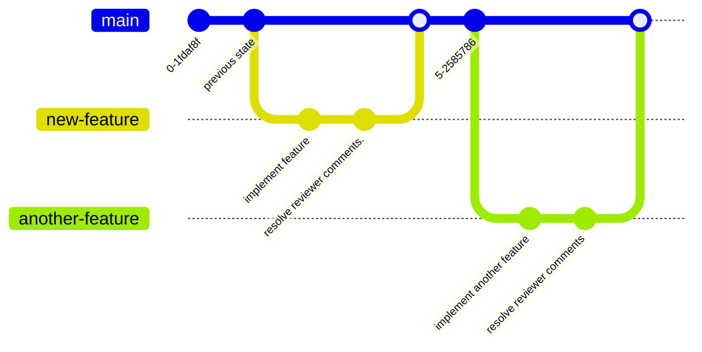
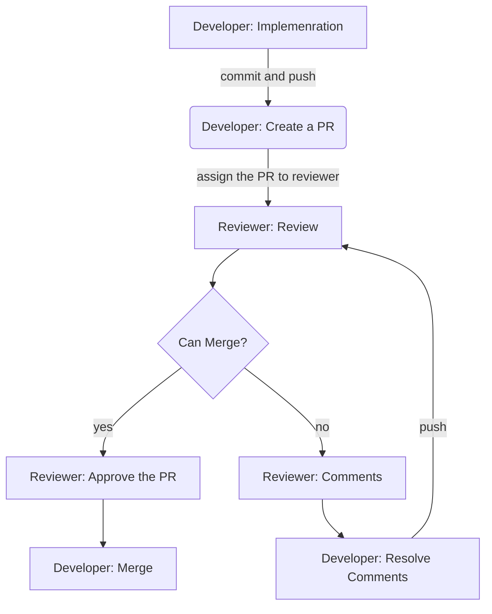

# Processes

## Feature implementation

```mermaid
---
title: 
---
gitGraph
   commit
   commit id: "previous state"
   branch new-feature
   checkout new-feature
   commit id: "implement feature"
   commit id: "resolve reviewer comments."
   checkout main
   merge new-feature
   commit
   branch another-feature
   checkout another-feature
   commit id: "implement another feature"
   commit id: "resolve reviewer comments"
   checkout main
   merge another-feature
```

## How to review?

```mermaid
flowchart TD
    A[Developer: Implemenration] -->|commit and push| B(Developer: Create a PR)
    B --> |assign the PR to reviewer| C[Reviewer: Review]
    C --> D{Can Merge?}
    D -->|yes| E[Reviewer: Approve the PR]
    E --> H[Developer: Merge]
    D -->|no| F[Reviewer: Comments]
    F --> G[Developer: Resolve Comments]
    G --> |push|C
```
