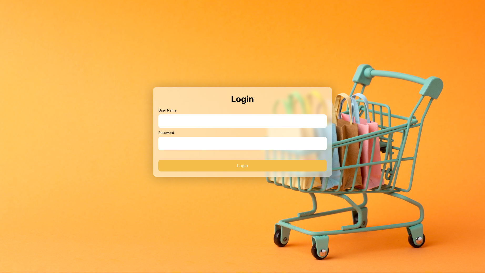
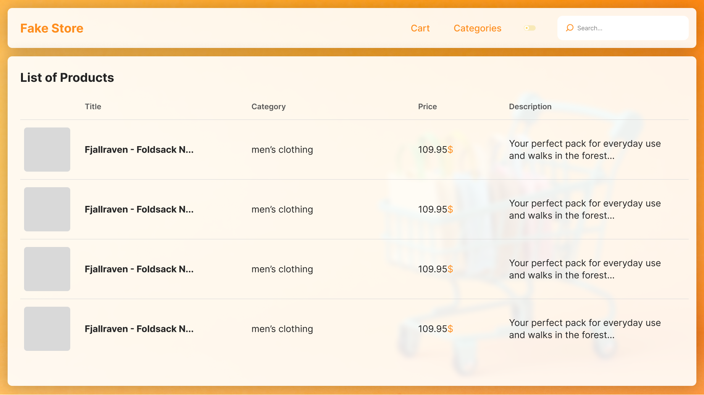
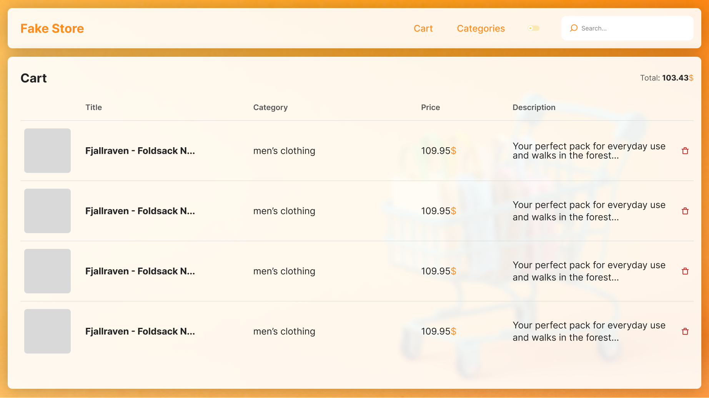

# Fake Store

## Description

This simple project is designed for interns who want to improve their skills in web development. The project is a 
fake store website that includes a **login page**, **homepage**, **cart page**, and **product page**. The interns will 
be responsible for implementing these pages in both light and dark modes, based on the designs provided in a 
[Figma link](https://www.figma.com/file/XRuYqIPKmeU5twdmEsTWZi/Fake-Store?type=design&node-id=0%3A1&t=hPlofMST1eaWcBFE-1).

To implement the cart functionality, interns will use `localStorage`, a built-in web API that allows developers to store 
data locally in the user's browser. They will also use the [Fake Store API](https://fakestoreapi.com/docs) to get 
information about products to display on the product page.

## Routes

| Page Name        | Route              |
|------------------|--------------------|
| **Login**        | `/`                |
| **Home Page**    | `/products`        |
| **Product Page** | `/products?id=:id` |
| **Cart Page**    | `/cart`            |

## Designs

## Related Links

- [Designs](https://www.figma.com/file/XRuYqIPKmeU5twdmEsTWZi/Fake-Store?type=design&node-id=0%3A1&t=hPlofMST1eaWcBFE-1)
- [API References](https://fakestoreapi.com/docs)
